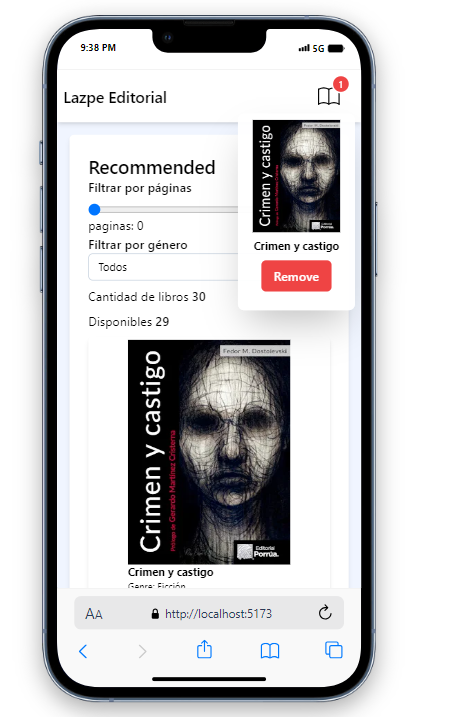

# Reading List App

Foobar is a Python library for dealing with word pluralization.

## Project description

This one of the challenge that can be found in Midudev-[pruebas técnicas](https://github.com/midudev/pruebas-tecnicas/tree/main). The challenge is about a library called **Lapze Editorial**, they required a page in which their users can see a list of books with information about them, and also they want to show a list of selected books in case users want to add them.

## Functionality

The project shows a list of provided books with their own information, when an user wants to know more about it, he/she can pick on it and read more information about the book, such as:

- Author
- Pages
- Cover of the book
- Year
- Rate of the book (added by me)

In addition, the user can add this book to a list of selected books to read it later.

With this application the user can keep a limited list of books that can be read, the user should keep in mind that the maximum selected number of books is up to 4. Of course, once the book has been read it can be removed as well. Once a book has been selected it will show a change of button to indicate that the selected book is already in the list, the book can be removed from the selected list at any time. If the user has reached the allowed limit and wants to add another book, an error message will be displayed in red. In addition, the user can filter books by number of pages and by category. Another important characteristic of the project is that localstorage has been used to preserve the list of selected book and it can also be synchronized in case another tab with the same project is open

## Projec Design

The project was completed following the main characteristics of the design provided, and also due to the importance of the project and in order to practice a little more, I decided to personalize it, adding different style and extra functionalities keeping in mind the complex of the code.

This is the first design provided


Here is the design I made in desktop view


In mobile



## Challenges during development and Tech used

To develop this project I mainly used React as the primary framework and Tailwind. Here you canfind a detailed list of what you can find in the project:

- React state (useState, useEffect, useContext, useReducer
- Tailwind
- Eslint
- Standard
- Prettier
- Vite
- General constants
- JSON book provided as a mock backend
- Fetch simulation of getting data from mock backend

During the development of the project I faced multiple problems such as:

1. Tab synchronization and use of localStorage
2. Keep state updated
3. Derive state instead of recreating
4. Understandin the use of **useContext** and **useReduce**
5. Refresh using **useEffect** based on dependencies

At the beginning of the project I felt overwhelmed because I thought I wasn't ready for it, but thanks to patience and persistence I could overcome all the obstacles.

Soon, I hope that I can add more functionalities like an extra filter by qualification of the book, and a less complex design

**FYI**

Even thogh this project was thought mainly for desktop users, I decided to implement a simple cellphone responsive design.

## Finally

I am very thankful to [Midudev](https://midu.dev/) who I consider a mentor. He gave everybody the chance to practice with this challenge. His videos make LATAM community a better one. Here you cand find his [repo](https://github.com/midudev), [Twitch](https://www.twitch.tv/midudev) and [Youtube](https://www.youtube.com/@midulive) channel.

Another importat mentor is Goncy, he helped me to see this project from another perspective. Thanks a lot.
Here you can find his [repo](https://github.com/goncy), [Youtube](https://www.youtube.com/@goncypozzo) channel and [Twitch](https://www.twitch.tv/goncypozzo)

Also, to inspire I checked some projects, I hope you find some inspiration the same way I did.
[danmondra](https://github.com/danmondra) and [krishee107](https://github.com/krishee107).

## To install the project

Clone the project, get into the folder and

```javascript
yarn install
```

After that

```javascript
yarn run dev
```

I recommend to use a .prettierrc doc in the main folder with the following

```javascript
{
  "useTabs": true,
  "jsxSingleQuote": true,
  "singleQuote": true,
  "trailingComma": "all",
  "arrowParens": "avoid",
  "semi": false
}

```

and in the .eslintrc.cjs

```javascript
module.exports = {
	root: true,
	env: { browser: true, es2020: true },
	extends: [
		'eslint:recommended',
		'plugin:react/recommended',
		'plugin:react/jsx-runtime',
		'plugin:react-hooks/recommended',
		'standard',
		'eslint-config-prettier',
	],
	ignorePatterns: ['dist', '.eslintrc.cjs'],
	parserOptions: { ecmaVersion: 'latest', sourceType: 'module' },
	settings: { react: { version: '18.2' } },
	plugins: ['react-refresh'],
	rules: {
		'react/jsx-no-target-blank': 'off',
		'react-refresh/only-export-components': [
			'warn',
			{ allowConstantExport: true },
		],
	},
}
```

I also added standar with the following patter

```javascript
yarn add standard -D
```

and in the package.json I added

```javascript
 "eslintConfig": {
    "extends": "./node_modules/standard/eslintrc.json"
  }
```

just after the "devDependencies".

I hope all work just fin for you.

Happy code.
